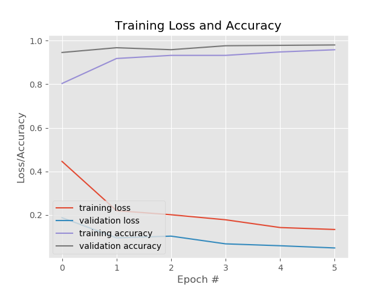
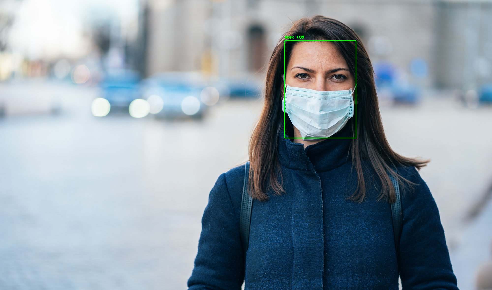
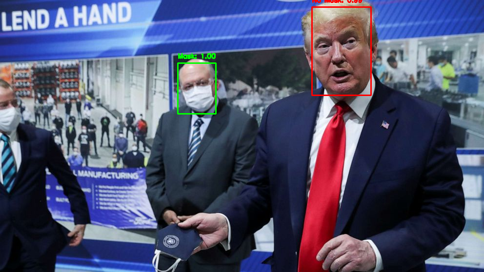

# Face Mask Detector
This project is a face mask detector that supports image and live video face mask detection built
with TensorFlow and OpenCV. The goal of this project is to transfer data science
and deep learning skills learned from classes to solve a real-world problem.
As the COVID-19 pandemic continues to expand, the demand of face mask detection
grows accordingly. This project aims to help grocery stores, malls
and other indoor venues with the "mask-on" policy.
## Training Data
700 images of people wearing masks (computer generated) and 700 images of people 
not wearing masks. 80% of the images are used as the training set and the
rest are used as validation.
## Model
MobileNet V2 pre-processing + Concolutional Neural Networks (CNN) architecture  

MobileNet V2: MobileNets are a class of small, low-latency, 
low-power models that can be used for classification, 
detection, and other commmon tasks. Because of their small size, these 
are considered great deep learning models to be used on 
mobile devices. I used the MobileNet V2 pre-processing to efficiently
process the input images.
  
CNN architecture: Two layers of Conv2D and two layers of Max Pooling are used. 0.3 dropout rate
and callback method are applied to avoid overfitting. The callback threshold is set at 0.95 to save computing resources.
  
Training result and callback
  



## Demo
  


## Deployment
### Train the model on a data set
Prepare a folder that contains 2 sub-folders, one named with_mask
and the other named without_mask with your training images.
```bash
python train_detector.py --d DataFolderDirectory --p PlotSavedDirectory --m ModelSavedDirectory
```
### Use a face detector to capture faces and feed them to the detector model
The pre-trained face detector helps with finding faces in an image.  
```bash
python detect_image.py --i TestImageDirectory
python detect_video.py
```
## Limitation
The model and data set selection sacrificed some accuracy for computing efficiency, so masks that are unconventional in style or color might not be detected.
